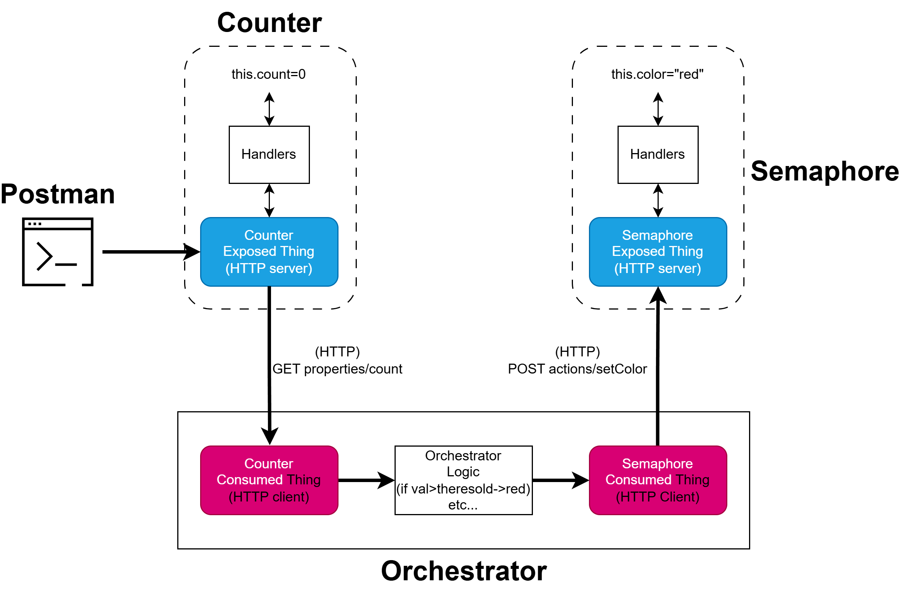
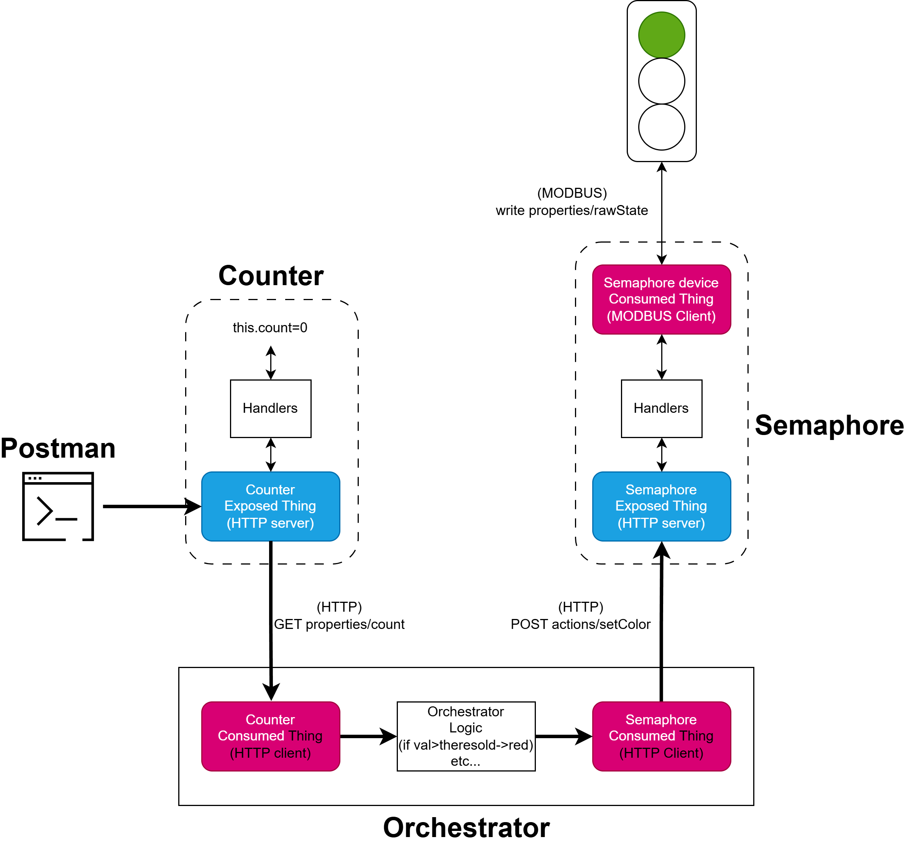

# Exercise: Semaphore Counter - Modbus (2025-12-09)
## Overview
In the previous laboratory session, you implemented an orchestrator application managing two Web Things:
- a Semaphore Thing
- a Counter Thing
In that setup:
- Each entity had its own exposed HTTP Thing, including property and action handlers.
- Each Thing consumed the others through HTTP clients, treating the exposed Things as APIs.  

The situation can be visualized in the following image:


**From HTTP-Only Things to a Device-Backed Thing**  
In this exercise, you will upgrade the Semaphore Thing so that its state is no longer simulated in memory, but instead stored in and retrieved from a Modbus-based emulated physical device, already implemented in src/mock/ModbusSemaphoreMockServer.ts.  

The orchestrator, webpage interface, and Counter Thing remain unchanged.  
This introduces two new conceptual layers:  

- Proxy Thing, a Human-readable semantic interface (handles HTTP protocol)
- Base Thing, a Direct API representation of the device registers (handles Modbus protocol)  

The exposed HTTP Thing acts as a semantic abstraction layer, while the consumed Modbus Thing interacts directly with the underlying device register.  
This architecture follows the **Web of Things Digital Twin Pattern**, also known as a Thing-to-Thing Overlay, widely adopted to wrap legacy or low-level devices with modern, web-based semantic interfaces.  
The new situation is represented in the following image:
 

## Step 1 — Configure the Servient
Refer to the documentation of the Modbus binding module:
🔗 https://www.npmjs.com/package/@node-wot/binding-modbus  
Configure a Servient with:
- An HTTP server (to expose Things locally)
- A Modbus client factory (to consume the Modbus device)
Expected outcome: your Servient must be able to expose HTTP Things and consume Modbus Things using the provided Thing Descriptions (TDs).
>> Add your code in src/main.ts

## Step 2: Implement ModbusSemaphoreThing Class
Using the provided Thing Descriptions (.td.json) and starting from the class template used in previous exercises:
1. Expose the proxy Thing, which represents the semaphore using a human-readable property (color: "red" | "yellow" | "green").
2. Consume the Modbus Thing, reading and writing the register that stores the raw semaphore state.
3. Implement the value mapping:
```
"red" -> 0
"yellow" -> 1
"green" -> 2
```
4. Register handlers for:
- color property reads
- setColor action calls
>> Once implemented, instantiate this class in src/main.ts alongside the Counter Thing by providing the servient implemented in the previous step, before starting the orchestrator.


## Step 3: Run and Verify
1. Start the mock semaphore device:  
```npm run start:mock```
2. Start the things and orchestrator:  
```npm run start:build```  
or build and start manually.  
3. Open **index.html** file in the exercise folder on a browser and verify that the webpage displays “connected”.
4. Increment the counter (via script or Postman) and check that the semaphore color updates correctly on the webpage.

## Notes
- The exposed things can be handled directly in the main function of src/main.ts or defined in a separate class. The latter is clearer and easier to handle.
- Make use of logs to verify communication between:  
    - HTTP clients  
    - The orchestrator logic  
    - The Modbus endpoint  