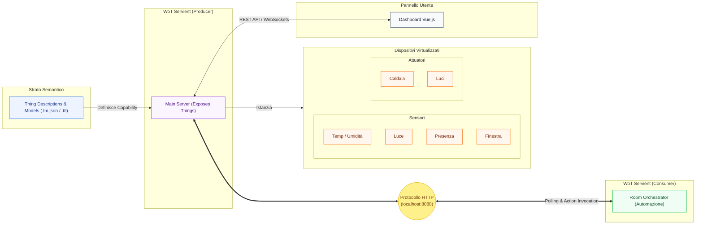

# Progetto (✅ APPROVATO)
## Gestione intelligente di una stanza tramite Web of Things


## Partecipanti  
**Gruppo:** C  

- Alex Cambrini - alex.cambrini@studio.unibo.it
- Lorenzo Ferrari - lorenzo.ferrari27@studio.unibo.it

---

## Idea generale del progetto  
Il progetto ha come obiettivo la realizzazione di un sistema **Web of Things (WoT)** per il monitoraggio e la gestione intelligente di una singola stanza, con particolare attenzione al **comfort ambientale** e alla **riduzione degli sprechi energetici**.

L’idea è modellare i principali elementi della stanza come **Thing WoT**, descritte tramite un modello semantico, che permetta di osservare lo stato dell’ambiente e di attuare semplici azioni automatiche in base a regole predefinite.

---

## Contesto e scenario  
Il sistema rappresenta una stanza (ad esempio aula, ufficio o camera) dotata di sensori ambientali e di un attuatore, in grado di reagire a variazioni di:
- temperatura e umidità
- luminosità
- presenza di persone
- stato di apertura di una finestra

Queste informazioni vengono utilizzate per prendere decisioni automatiche, simulando una gestione intelligente dell’energia all’interno dell’ambiente.

---

## Thing WoT previste  
Il progetto prevede la creazione delle seguenti Thing:

- **Sensore di temperatura e umidità**  
  Rappresenta le condizioni termiche e di comfort della stanza.

- **Sensore di luminosità**  
  Fornisce informazioni sulla luce ambientale naturale o artificiale.

- **Sensore di presenza**  
  Indica se la stanza è occupata o meno.

- **Sensore di stato finestra**  
  Indica se una finestra è aperta o chiusa, informazione utile per la gestione energetica.

- **Attuatore (relè)**  
  Permette di simulare l’accensione o lo spegnimento di un dispositivo (ad esempio luce, riscaldamento o ventilazione).

---

## Relazioni e logica di funzionamento  
Le Thing sono collegate tra loro tramite **regole logiche**, che permettono al sistema di reagire in modo automatico alle condizioni dell’ambiente. Alcuni esempi di relazioni tra i dati raccolti:

- **Presenza e illuminazione**  
  In presenza di persone e con un basso livello di luminosità, il sistema può attivare l’attuatore per accendere la luce.  
  In assenza di presenza, le luci vengono spente per ridurre i consumi.

- **Presenza e temperatura**  
  Le azioni legate al comfort termico vengono considerate solo quando la stanza è occupata, evitando sprechi energetici quando è vuota.

- **Finestra e gestione energetica**  
  Se una finestra risulta aperta, il sistema può disattivare dispositivi come il riscaldamento o la ventilazione, oppure evitare che vengano attivati.

- **Umidità e aerazione**  
  Valori elevati di umidità, combinati con lo stato della finestra, possono influenzare le decisioni del sistema, suggerendo o simulando azioni di ventilazione.

---

## Flusso di Esecuzione e Architettura del Sistema

Il nostro sistema implementa lo standard **W3C Web of Things (WoT)** per far comunicare i dispositivi IoT usando tecnologie web come **HTTP**. Ogni sensore e attuatore è descritto da una **Thing Description (TD)** in JSON, che funziona come un manuale d'uso spiegando cosa il dispositivo può fare e che dati trasmette.

L'infrastruttura si basa sul concetto di **Servient**, un componente software che può comportarsi sia da server ("Producer") che da client ("Consumer").

Nel nostro progetto i componenti sono così suddivisi:
- **Main Backend (Producer)**: Il cuore del sistema. Carica le Thing Descriptions ed espone sensori e attuatori tramite un server HTTP (porta 8080).
- **Room Orchestrator (Consumer)**: Il "cervello" della stanza. Legge le caratteristiche dei dispositivi esposti e interroga ciclicamente il loro stato (tramite *polling*).
- **Flusso Logico**: L'orchestratore valuta le condizioni ambientali (es. "se c'è buio e qualcuno è presente, accendi la luce") e invia le corrispondenti azioni HTTP agli attuatori.

Ecco l'architettura completa delle interazioni:




---
### L'Ontologia Semantica

L'architettura del sistema affianca al livello operativo un livello semantico, modellato all'interno del file `ontology.ttl` ed esteso formalmente all'interno di tutte le Thing Descriptions (`.tm.json`).

L'obiettivo dell'ontologia non è solo classificare i dispositivi a livello locale (es. `smart:Boiler`, `smart:TempHumiditySensor`), ma soprattutto **mappare i nostri dispositivi su standard globali del W3C/ETSI**, nello specifico:
- **SAREF** (Smart Applications REFerence ontology): usato per validare univocamente l'identità degli elettrodomestici (es. `saref:TemperatureSensor`, `saref:Heater`, `saref:LightSwitch`).
- **SOSA** (Sensor, Observation, Sample, and Actuator): usato per dichiarare a un livello astratto se un nodo sta compiendo osservazioni sull'ambiente o alterandone lo stato.

**Perché implementare questo livello?** 
Sebbene la logica locale dell'orchestratore utilizzi chiamate HTTP dirette verso i nodi per garantire semplicità e prestazioni ("Simple things are smart together"), l'esposizione semantica permette una totale **Interoperabilità Esterna (Dynamic Discovery)**.
Se questa Smart Room venisse agganciata a un hub commerciale esterno universale (es. Google Home), quest'ultimo, leggendo le Thing Description, comprenderebbe immediatamente il ruolo di ogni dispositivo grazie ai tag standard SAREF/SOSA, integrandoli nel proprio ecosistema senza richiedere configurazioni manuali o modifiche al codice. L'interoperabilità risulta quindi completamente agnostica ed aderente in pieno alle specifiche del **Web of Things**.

---

## Stack Tecnologico

| Livello | Tecnologie |
|--------|------------|
| Backend | Node.js, TypeScript, TSX |
| Frontend | Vue.js, Vite |
| Comunicazione | HTTP / REST |

---

## Interfaccia Utente (Dashboard)

Il sistema integra una piattaforma frontend progettata in **Vue.js** (accessibile via browser in fase di esecuzione) che offre un punto di controllo centralizzato per l'intero ambiente. 

In particolare, la dashboard consente all'utente finale di:

- monitorare in tempo reale lo stato dei sensori e la presenza umana.
- visualizzare lo storico e l'andamento dei dati ambientali.
- forzare l'override controllando manualmente i singoli attuatori (luci e caldaia).
- alterare le regole operazionali globali del sistema (Es. *"Home"*, *"Away"*) interagendo con l'**Admin Panel**.

---

## Come avviare il progetto

L'ambiente di sviluppo è strutturato per consentire un rapido avvio parallelo del backend Web of Things e dell'interfaccia utente (Vue.js).

1. **Installazione dipendenze:**  
   Tramite terminale, posizionarsi nella root directory del progetto ed eseguire l'installazione dei pacchetti richiesti:
   ```bash
   npm install
   ```

2. **Avvio simultaneo (Procedura Predefinita):**  
   Avvalendosi dell'utility `concurrently` preconfigurata, è possibile lanciare simultaneamente sia il modulo di orchestrazione backend che il server web di sviluppo frontend con un singolo comando:
   ```bash
   npm run dev
   ```

3. **Restrizione Log (Avvio separato):**
   Qualora si renda necessario monitorare l'output di esecuzione in modo disgiunto per attività di debugging, è possibile avviare i due applicativi in istanze terminali separate:
   ```bash
   npm run dev:backend
   ```
   ```bash
   npm run dev:ui
   ```

Ad avvio completato, il sistema backend esporrà le proprie interfacce sulla porta locale `8080`, mentre la dashboard utente sarà raggiungibile all'indirizzo `http://localhost:5173`.
