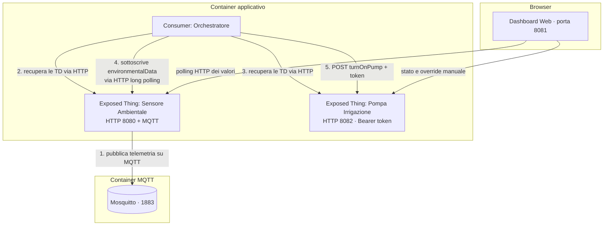

# Smart Greenhouse: Sistema di Monitoraggio ed Irrigazione Intelligente

[](https://www.w3.org/WoT/)
[](https://www.w3.org/TR/wot-thing-description11/)
[](#binding-di-protocollo)
[](#come-avviare-il-progetto)

## Partecipanti

**Gruppo: F**

* **Matteo Aloè** — [matteo.aloe3@studio.unibo.it](mailto:matteo.aloe3@studio.unibo.it)
* **Elia Strazzella** — [elia.strazzella@studio.unibo.it](mailto:elia.strazzella@studio.unibo.it)

---

## Idea generale del progetto

Il progetto realizza un sistema **Web of Things (W3C)** per il monitoraggio e la gestione
intelligente di una serra agricola, con attenzione al benessere termico e idrico delle
coltivazioni e all'ottimizzazione dell'irrigazione per prevenire sprechi d'acqua.

I componenti della serra sono modellati come **Thing WoT**, descritte da Thing Description
in JSON-LD annotate semanticamente, che permettono di osservare lo stato dell'ambiente in
tempo reale e di attuare azioni correttive automatiche secondo regole dinamiche e
proporzionali.

---

## Contesto e scenario

Una serra dotata di un nodo sensore ambientale e di un attuatore (pompa dell'acqua),
capace di reagire alle variazioni di:

* **temperatura dell'aria** (°C)
* **umidità del suolo** (% relativa)

Il sistema supporta **due configurazioni di serra**, commutabili a runtime, che cambiano
sia le condizioni ambientali simulate sia la politica di irrigazione:

| Configurazione | Temperatura simulata | Umidità simulata | Soglia di irrigazione |
| :--- | :--- | :--- | :--- |
| `tropical` | 24–32 °C | 25–50 % | umidità < **40 %** |
| `mediterranean` | 18–26 °C | 30–60 % | umidità < **30 %** |

---

## Le Thing WoT

### 1. Sensore Ambientale — `urn:dev:wot:greenhouse-environmental-sensor-01`

Annotato `sosa:Sensor`. Espone:

| Affordance | Tipo | Note |
| :--- | :--- | :--- |
| `temperature` | Property, sola lettura | `sosa:ObservableProperty`, `qudt:unit: unit:DEG_C` |
| `humidity` | Property, sola lettura | `sosa:ObservableProperty`, `qudt:unit: unit:PERCENT` |
| `activeGreenhouse` | Property, **scrivibile** | `enum` di `tropical` / `mediterranean` |
| `environmentalData` | Event | `sosa:Observation`, pubblicato su MQTT a intervalli regolari |

**Perché `activeGreenhouse` è una Property e non una Action.** La specifica W3C riserva le
Action ai processi che richiedono tempo o che toccano stato non esposto; le Property
modellano stato leggibile e scrivibile istantaneamente. Il tipo di serra è stato di
configurazione, quindi è una Property scrivibile, con un write handler che rifiuta i valori
fuori dall'`enum`.

### 2. Pompa di Irrigazione — `urn:dev:wot:greenhouse-irrigation-pump-01`

Annotata `sosa:Actuator`. Espone:

| Affordance | Tipo | Note |
| :--- | :--- | :--- |
| `pumpStatus` | Property, sola lettura | `sosa:ActuatableProperty`, boolean |
| `turnOnPump` | Action | `sosa:Actuation`, input intero 1–300 s (`qudt:unit: unit:SEC`), output di conferma |

**Perché `turnOnPump` è una Action.** Accende la pompa e la spegne dopo la durata richiesta:
è un processo con una durata che modifica lo stato fisico nel tempo, il caso da manuale
della definizione di Action nella *WoT Architecture*.

L'accesso all'attuatore è protetto dallo schema di sicurezza **`bearer`**: senza header
`Authorization: Bearer <token>` ogni richiesta riceve `401 Unauthorized`.

---

## Logica di controllo

L'orchestratore riceve la telemetria, rilegge a ogni ciclo la configurazione di serra
attiva e, se l'umidità è sotto la soglia corrispondente, calcola una durata di irrigazione
**proporzionale al deficit**: più il suolo è secco, più lungo è il ciclo. Una durata fissa
irrigherebbe troppo per deficit piccoli e troppo poco per suoli molto secchi.

| Umidità rilevata | Serra tropicale (soglia 40 %) | Serra mediterranea (soglia 30 %) |
| :--- | :--- | :--- |
| ≥ soglia | nessuna irrigazione | nessuna irrigazione |
| deficit lieve | ≥ 35 % → **5 s** | ≥ 25 % → **5 s** |
| deficit medio | ≥ 30 % → **10 s** | ≥ 20 % → **10 s** |
| deficit alto | ≥ 25 % → **20 s** | ≥ 15 % → **15 s** |
| stato critico | < 25 % → **30 s** | < 15 % → **25 s** |

Un flag nell'orchestratore impedisce di sovrapporre due cicli: la telemetria arriva ogni
pochi secondi mentre un ciclo può durarne trenta. L'attuatore applica lo stesso vincolo lato
server, rifiutando un secondo `turnOnPump` mentre la pompa è già attiva.

La tabella vive in un unico punto, `src/greenhouse.ts`, in funzioni pure senza I/O: il
sensore la usa per generare letture coerenti, l'orchestratore per decidere.

---

## Architettura

Il sistema si basa sul concetto di **Servient**, il runtime WoT che può agire da Producer,
da Consumer o da entrambi:

* **Sensore Ambientale** — Producer. Espone le property su HTTP (porta 8080) e pubblica la
  telemetria sul broker MQTT.
* **Pompa di Irrigazione** — Producer. Espone stato e azione su HTTP protetto (porta 8082).
* **Orchestratore** — Consumer puro. Recupera le due Thing Description via HTTP, le consuma,
  si sottoscrive all'evento del sensore e comanda la pompa autenticandosi col token.


```mermaid
graph TD
    subgraph Browser
        DB[Dashboard Web · porta 8081]
    end

    subgraph Container MQTT
        Broker[(Mosquitto · 1883)]
    end

    subgraph Container applicativo
        Sensor[Exposed Thing: Sensore Ambientale<br>HTTP 8080 + MQTT]
        Pump[Exposed Thing: Pompa Irrigazione<br>HTTP 8082 · Bearer token]
        Orch[Consumer: Orchestratore]
    end

    Sensor -- 1. pubblica telemetria su MQTT --> Broker
    Orch -- 2. recupera le TD via HTTP --> Sensor
    Orch -- 3. recupera le TD via HTTP --> Pump
    Orch -- 4. sottoscrive environmentalData<br>via HTTP long polling --> Sensor
    Orch -- 5. POST turnOnPump + token --> Pump

    DB -- polling HTTP dei valori --> Sensor
    DB -- stato e override manuale --> Pump
```

### Binding di protocollo

Il progetto usa **due binding**: `@node-wot/binding-http` e `@node-wot/binding-mqtt`. La
scelta segue il modello di interazione: la telemetria è un flusso periodico verso molti
possibili consumatori, quindi publish/subscribe su MQTT; il comando alla pompa è una
richiesta puntuale con esito e controllo d'accesso, quindi request/response su HTTP.

> **Nota onesta sul binding effettivamente usato dal Consumer.** Il sensore è esposto su
> entrambi i protocolli e pubblica realmente la telemetria sul broker MQTT, ma
> l'orchestratore riceve gli eventi in **HTTP long polling**, non da MQTT. La causa sta nel
> runtime, e vale la pena scriverla per esteso perché è controintuitiva.
>
> `Servient.expose()` **azzera le `forms` di ogni affordance** prima di passare il Thing ai
> server registrati, che poi ne generano di proprie; l'href scritto nella TD sopravvive solo
> come template per i metadati accessori. Le form finali sono quindi nell'ordine in cui i
> server sono stati registrati in `src/sensors.ts` — prima `HttpServer`, poi
> `MqttBrokerServer` — e `subscribeEvent` senza `formIndex` prende la prima form il cui
> scheme ha una ClientFactory disponibile. Prima viene HTTP, e HTTP resta.
>
> Il topic MQTT reale non è quello della TD: `MqttBrokerServer` lo deriva dal `title` con
> `encodeURIComponent`, quindi è `Sensore%20Ambientale%20Serra/events/environmentalData`,
> osservabile con un client esterno (per esempio MQTT Explorer).
>
> Forzare `formIndex` sulla form MQTT del solo evento **rompe le letture di property**: la
> cache dei client in `ConsumedThing` è indicizzata per scheme, quindi il client MQTT
> entrato in cache viene riusato dalla `readProperty` successiva, e
> `MqttClient.readResource()` in node-wot 0.8 è `throw new Error("Method not implemented.")`.
> Funzionerebbe solo indicizzando esplicitamente **entrambe** le interazioni; abbiamo
> preferito lasciare scegliere al runtime.

---

## Il livello semantico

Le Thing Description sono documenti **JSON-LD** conformi alla
**Thing Description 1.1** (W3C Recommendation del 5 dicembre 2023), con contesto
`https://www.w3.org/2022/wot/td/v1.1`. Il `@context` dichiara i prefissi dei vocabolari
riusati, che è ciò che trasforma una stringa come `sosa:Sensor` in un IRI globale e rende
la TD un grafo RDF caricabile in un triple store senza conversioni.

| Vocabolario | Uso |
| :--- | :--- |
| **SOSA/SSN** (W3C) | `sosa:Sensor`, `sosa:Actuator`, `sosa:ObservableProperty`, `sosa:ActuatableProperty`, `sosa:Actuation`, `sosa:Observation` |
| **QUDT** | `qudt:unit` con `unit:DEG_C`, `unit:PERCENT`, `unit:SEC` |

L'annotazione è applicata **a livello di Thing e di singola affordance**: un hub di terze
parti che legge le TD capisce che un nodo compie osservazioni, in quali unità, e che
l'altro altera lo stato del mondo — senza sapere nulla di questo progetto.

Le due TD sono inoltre collegate da **web links** reciproci (`rel: controls` dal sensore
verso la pompa, `rel: controlledBy` in senso inverso): sono il quinto componente di una TD
e ciò che rende navigabile il grafo di Things, per gli umani e per le macchine.

---

## Struttura del codice

```
src/
├── config.ts             Costanti e variabili d'ambiente in un unico punto
├── greenhouse.ts         Profili delle due serre e logica di irrigazione (funzioni pure)
├── thing-description.ts  Caricamento delle TD dai file JSON-LD
├── sensors.ts            Producer: Thing del sensore ambientale
├── actuators.ts          Producer: Thing della pompa
├── orchestrator.ts       Consumer: recupera, consuma, ascolta e comanda
├── dashboard-server.ts   Server statico della dashboard
├── launcher.ts           Avvio unificato dei tre componenti
├── td/                   Le due Thing Description in JSON-LD
└── dashboard/            Pagine HTML, CSS e script della dashboard
```

Ogni modulo ha una responsabilità sola. La logica di controllo sta in funzioni pure senza
I/O, quindi è leggibile e verificabile indipendentemente dal runtime WoT; i valori
configurabili non sono ripetuti nei file ma importati da `config.ts`.

### Stack tecnologico

| Livello | Tecnologie |
| :--- | :--- |
| Runtime WoT | Node.js, TypeScript, `@node-wot/core`, `binding-http`, `binding-mqtt` |
| Frontend | HTML5, CSS3, JavaScript ES6, Chart.js |
| Broker | Eclipse Mosquitto |
| Deployment | Docker, Docker Compose |

---

## Interfaccia utente

Dashboard sulla porta **8081**, con quattro pagine:

* **`/`** — panoramica: valori correnti, stato della pompa, storico FIFO delle ultime 5
  letture, selezione della configurazione di serra, override manuale dell'irrigazione, e la
  Thing Description del sensore scaricata live dall'endpoint.
* **`/temperature`** e **`/humidity`** — grafico Chart.js delle letture e dettaglio
  dell'endpoint WoT corrispondente.
* **`/pump`** — console protetta: richiede il Bearer token, poi sblocca il controllo manuale
  con un log locale delle attivazioni.

---

## Come avviare il progetto

### Con Docker (consigliato)

```bash
docker-compose up --build
```

Poi aprire `http://localhost:8081/`. Per la console della pompa, il token è
`chiave-segreta-pompa`.

### In locale

Serve un broker MQTT in ascolto su `localhost:1883`.

```bash
npm install
npm run start           # avvia i tre componenti in un solo processo
```

Oppure separatamente, in tre terminali:

```bash
npm run start:sensor
npm run start:pump
npm run start:orchestrator
```

### Variabili d'ambiente

| Variabile | Default | Descrizione |
| :--- | :--- | :--- |
| `MQTT_BROKER` | `mqtt://localhost:1883` | URI del broker; in Docker vale `mqtt://broker:1883` |
| `TELEMETRY_INTERVAL` | `10000` | Intervallo di campionamento in millisecondi |
| `PUMP_TOKEN` | `chiave-segreta-pompa` | Bearer token dell'attuatore |
| `PUBLIC_HOST` | `localhost` | Host con cui i Thing si annunciano negli href della propria TD |

---

## Sicurezza: cosa è protetto e cosa no

**Cosa è protetto.** L'attuatore è l'unico componente in grado di produrre effetti fisici,
ed è protetto con lo schema `bearer` del WoT Security Vocabulary — l'API Key vista a
lezione. La TD dichiara solo il **meccanismo** (`"scheme": "bearer"`), che è un *Public
Security Metadata*; il token è un *Private Security Data* e vive nel Servient, iniettato con
`addCredentials`, mai nel documento TD. È la separazione prescritta dalla *WoT Architecture*.

**Cosa resta scoperto**, e ne siamo consapevoli:

* **Il canale di telemetria non è autenticato.** La TD del sensore usa `nosec`, quindi
  l'endpoint HTTP da cui l'orchestratore riceve gli eventi è aperto a chiunque raggiunga la
  porta 8080, e altrettanto lo è la scrittura di `activeGreenhouse`, che cambia la soglia di
  irrigazione. Il broker è a sua volta configurato con `allow_anonymous true`: oggi nessuno
  consuma quel topic, ma il giorno in cui un Consumer ci si sottoscrivesse basterebbe
  pubblicarci sopra letture di umidità false per far irrigare la serra. Le difese reali
  sarebbero uno schema di sicurezza anche sul sensore e MQTT su TLS con credenziali,
  dichiarate nella TD come `basic` o `psk`.
* **Il token della dashboard è lato client.** In `dashboard.html` è una costante JavaScript:
  chiunque apra il sorgente della pagina lo legge, quindi su quel percorso la protezione
  dell'attuatore è aggirabile. In un sistema reale la pagina otterrebbe un token a tempo da
  un authorization server via OAuth2, senza mai conservarlo nel codice.

---

## Difficoltà incontrate e soluzioni adottate

**1. Il Bearer token non veniva mai riconosciuto.** Con una TD conforme alla specifica, che
richiede `"scheme": "bearer"` in minuscolo, ogni richiesta autenticata riceveva comunque
`401`. La causa è un bug di node-wot 0.8: il server confronta lo scheme in modo
case-sensitive contro la stringa `"Bearer"`. Le due strade erano scrivere `"Bearer"` nella
TD, rendendola non conforme, oppure correggere il runtime. Abbiamo scelto la seconda:
`patchBearerCaseSensitivity` in `src/actuators.ts` avvolge `checkCredentials`, alza lo
scheme per la durata del controllo e lo ripristina subito dopo. Il documento TD resta
conforme e l'autenticazione funziona.

**2. L'indirizzo del broker cambia tra sviluppo e Docker.** Il primo tentativo è stato
riscrivere a runtime l'host della form MQTT partendo da `MQTT_BROKER`. Non serviva a niente:
`Servient.expose()` cancella quella form un istante dopo. L'indirizzo che conta è l'unico
che il runtime legge davvero, cioè quello passato a `new MqttBrokerServer({ uri })` in
`src/sensors.ts`, e arriva anch'esso dalla variabile d'ambiente. Una sola TD e due ambienti
li otteniamo comunque, ma per la via della configurazione del server, non del documento.

**3. node-wot deriva lo slug HTTP dal `title`, non dall'`id`.** Il Thing con id
`urn:dev:wot:greenhouse-environmental-sensor-01` viene esposto su
`/sensore-ambientale-serra`, non su `/greenhouse-environmental-sensor`. Ci è costato del
tempo di debug su `requestThingDescription`, che falliva con un errore di validazione poco
parlante (`must be object`) perché stava in realtà ricevendo una 404. Gli URL sono ora
centralizzati in `config.ts`, con il motivo annotato, così l'errore non si ripete.

**4. Gli href della TD puntavano dentro il container.** node-wot compone gli href con il
primo indirizzo di rete non interno della macchina: in Docker è l'IP privato del container,
per esempio `http://172.18.0.3:8080/...`. La TD si scaricava benissimo da
`localhost:8080`, ma le form che conteneva erano irraggiungibili da fuori — cioè il
documento era inutile proprio per il Consumer esterno che è la ragione di esistere di una
TD. Non ce ne eravamo accorti perché la dashboard non segue le form: ha gli URL scritti nel
sorgente, quindi funzionava mentre un Consumer corretto avrebbe fallito. Risolto passando
`baseUri` a `HttpServer`, con l'host preso da `PUBLIC_HOST`.

**5. La form MQTT dichiarata nella TD viene ignorata.** È il punto documentato sopra in
*Binding effettivamente usato*. Ce ne siamo accorti osservando il traffico sul broker, non
leggendo il codice, e la causa esatta è emersa solo aprendo il `dist/` di node-wot. È la
lezione più utile del progetto, e va oltre il singolo bug: la TD che il file descrive e la
TD che l'endpoint serve sono due documenti diversi. Un Consumer terzo che leggesse il nostro
`environmental-sensor.td.json` si sottoscriverebbe su MQTT, perché lì l'evento dichiara solo
quella form; lo stesso Consumer, partendo da `http://localhost:8080/sensore-ambientale-serra`,
finisce su HTTP. Il documento descrive le intenzioni, il runtime decide, e le due cose vanno
verificate sul campo.

---

## Riferimenti

* [W3C Web of Things Architecture 1.1](https://www.w3.org/TR/wot-architecture11/)
* [W3C Web of Things Thing Description 1.1](https://www.w3.org/TR/wot-thing-description11/)
* [W3C Semantic Sensor Network Ontology (SOSA/SSN)](https://www.w3.org/TR/vocab-ssn/)
* [QUDT](http://qudt.org/) · [Eclipse Thingweb](https://thingweb.io) · [TD Playground](https://playground.thingweb.io)
